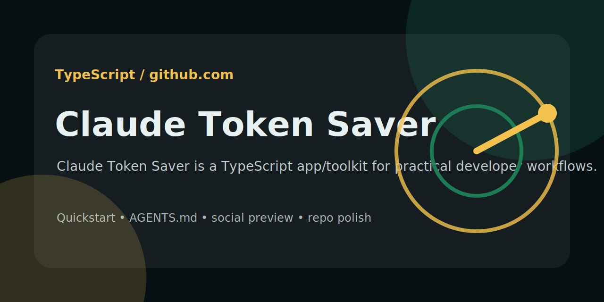

# agent-token-saver



**Use your coding agent more. Spend far fewer tokens getting there.**

[](LICENSE)
[](https://github.com/Supersynergy/agent-token-saver/actions/workflows/ci.yml)


> **Imagine getting 100x more context-heavy work from Codex, Claude Code,
> Hermes or GG Coder before hitting the same token budget. In the included
> accepted-workload fixture, 375,673 estimated visible-input units became
> 1,887 -- 99.50% less payload, or 199.1x more comparable payload capacity.**

`agent-token-saver` stops wasted tokens before they reach your model. It sends
the smallest context that can still produce the correct result: the relevant
skills, the useful error lines, the needed code and the right tools for this
task.

Verified with Codex CLI, Claude Code, Hermes Agent and GG Coder. The repo-local
skill plus CLI/JSON interfaces also work with agents that understand
`SKILL.md` or can run shell commands. No API keys or private configuration are
shipped.

The public core does not depend on a private memory service, private web
fetcher or host-only tool. It installs only its own files and detects optional
public CLIs already present on the machine.

## What this means in plain English

Without routing, a coding agent may receive 460 skill descriptions, a complete
process table, a full README and a 20,000-line log before it starts solving the
task. Most of those tokens never help the answer.

With `agent-token-saver`, the same accepted fixture carried:

- **1,887 instead of 375,673 estimated visible-input units** in the CLI-selective profile.
- **3,782 instead of 375,673 estimated visible-input units** in the automatic Lean profile.
- **Up to 99.50% less visible input** across the measured fixture.
- **Up to 199 comparable payloads** inside the payload budget previously used by one raw fixture.

That leaves more visible context-window room. It does not by itself prove the
same reduction in provider input, billing or subscription quota; use the
provider ledger and an accepted A/B for that claim.

It does **not** make the model cheaper by making it dumber. It removes context
the task did not need while keeping required evidence, errors, approvals and
acceptance checks intact.

## Why this exists

Most "token optimization" advice asks humans to think about tokens all day.
That is backwards.

`agent-token-saver` makes the token-efficient choice automatic, preserves the
evidence needed for a good answer and keeps heavy tools one command away. Your
agent reads less irrelevant text, consumes fewer tokens and keeps more of its
context window for judgment and implementation.

**The result:** one understandable stack, four workload profiles, explicitly
labelled payload and provider measurements, reversible hooks and no lock-in.

## Commitment and next proof

The default remains zero-hot: no broad skill catalog, browser, graph, local
model or extra MCP schema enters every request. A new layer belongs in Lean
only after the same accepted task shows a net gain in provider usage or quota,
latency and correctness; otherwise it remains an explicit CLI or session tool.

The next evidence this project still needs is deliberately narrow:

1. Repeat the current Codex provider tasks in ABBA order and add fresh-host
   provider A/Bs for Claude, Hermes and GG Coder with model/runtime pinned.
2. A parent-plus-children benchmark on independent coding lanes that records
   bootstrap, retries, cache classes and final oracle—not just child speed.
   A first Claude-side datapoint exists
   ([claude-team-ab-2026-07-16](data/benchmarks/claude-team-ab-2026-07-16.md):
   team = 3.0x a single projection worker, raw read = 14.2x and wrong), the
   stagger-vs-simultaneous follow-up is measured and refuted
   ([claude-stagger-ab-2026-07-19](data/benchmarks/claude-stagger-ab-2026-07-19.md)),
   and a Kimi CLI lane exists
   ([kimi-lane-2026-07-19](data/benchmarks/kimi-lane-2026-07-19.md): lean
   child = 16% of the Claude child's gross input on the same lane); Codex,
   Hermes and GG Coder lanes are still open.
3. Native Codex shell-hook coverage before any transparent shell rewriting is
   claimed; until then Codex uses explicit `rtk` CLI guidance.

These are proof obligations, not default dependencies. Existing acceptance
checks, artifacts and profiles stay valid while new evidence is collected.

## The measured result

Local benchmark, 2026-07-15. Same accepted workload and deterministic fixtures
in every arm. Visible input is a UTF-8 bytes / 4 proxy. Reused Ponytail output
counts remain a separate A/B and are not combined with these unrelated
component fixtures; the matrix is not provider billing.

This is a **profile payload benchmark**, not a claim that a brand-new host will
immediately reduce its complete provider bill by 199.1x. The full profile used
the named Router, RTK and Tilth components. Clean-host portability and complete
provider context are measured separately below.

| Stack | Estimated payload per workload | Payload reduction | Capacity in the same raw payload budget |
|---|---:|---:|---:|
| **CLI selective** | **1,887** | **99.50%** | **199.1x** |
| Lean automatic | 3,782 | 98.99% | 99.3x |
| Context-mode on demand | 9,420 | 97.49% | 39.9x |
| Everything + Ponytail | 12,614 | 96.64% | 29.8x |
| No saver | 375,673 | 0% | 1.0x |

### What "100x more payload capacity" actually means

Take the estimated visible payload carried by one raw benchmark workload:
**375,673 units**.

- Raw approach: that budget carries **1** comparable workload.
- CLI-selective profile: that budget carries **199 full comparable payloads**.
- Automatic Lean profile: that budget carries **99 full comparable payloads**.
- Across 100 comparable fixtures: **37,567,300 raw payload units vs 188,700 CLI-selective units**.

The multiplier is `raw tokens / optimized tokens`. It measures useful payload
capacity, not a promise of 196x more provider calls or fewer billed tokens: subscription rate limits,
cache accounting, model output, tool calls and task mix still matter. If tokens
or quota are your bottleneck and your workload resembles this one, however,
the practical gain can be enormous.

### Where the tokens disappear

| Instead of sending this | The agent receives this | Measured reduction |
|---|---|---:|
| All 460 installed skills | One primary skill pointer | 99.74% |
| Full noisy process fixture | RTK's useful projection | 97.25% |
| Full source file | A bounded structural read | 88.98% |
| A 20,000-line log | Exact error count + last 10 errors | 99.94% |

The model still gets the facts needed to pass the same acceptance check. It
simply stops paying attention to everything else.

The cheapest default is not “enable everything”:

```text
skill router -> RTK -> deterministic projection
             -> Tilth on demand -> workload-gated heavy tools
```

Reproduce it:

```bash
python3 scripts/token_stack_matrix_benchmark.py \
  --reuse-live data/benchmarks/token-stack-matrix-2026-07-15.json
```

Raw result: [data/benchmarks/token-stack-matrix-2026-07-15.md](data/benchmarks/token-stack-matrix-2026-07-15.md).

## Current provider-boundary result

Codex CLI 0.144.3 with `gpt-5.6-sol`, fresh HOME per arm, identical task
prompts and executable answer/command oracles. One baseline and one compact
Lean run were accepted for each of three tasks:

| Task | Baseline total | Lean total | Provider total change |
|---|---:|---:|---:|
| Process fixture | 29,359 | 38,800 | **32.16% more** |
| Large Git diff | 44,629 | 25,886 | **42.00% less** |
| Git history | 38,500 | 25,678 | **33.30% less** |
| **Aggregate** | **112,488** | **90,364** | **19.67% less** |

All three oracles passed. The automatic route uses a compact inline policy;
an explicit `$agent-token-saver` still loads the full canonical skill. This is
real provider usage, but one run per arm is not a confidence interval and it
does **not** prove 99% end-to-end savings. An attempted follow-up was retained
as invalid after the account usage limit interrupted its baseline.

Artifacts and raw JSONL:
[data/benchmarks/codex-provider-ab-2026-07-15/README.md](data/benchmarks/codex-provider-ab-2026-07-15/README.md).

## Does it work on a neutral machine?

Yes for the portable core. Every push runs a fresh-HOME install on a clean
GitHub-hosted Ubuntu runner. It verifies the installer, CLI, ledger, Codex and
Claude hook files, Hermes and GG Coder skills, and the repo-local skill without
this machine's dotfiles.

There are two deliberately separate states:

- `core-ready`: portable skill, hooks, doctor and token ledger work; optional
  optimizers may be missing.
- `full`: every component selected by that profile is installed and detected.

```bash
bash scripts/neutral_install_smoke.sh
bash scripts/remote_bootstrap_smoke.sh
agent-token-saver doctor --profile lean --json
```

Live neutral runner: [GitHub Actions](https://github.com/Supersynergy/agent-token-saver/actions/workflows/ci.yml).

## Profiles

| Profile | Use | Default components |
|---|---|---|
| `minimal` | Zero-hot portable CLI/ledger | no visible skill and no prompt hook |
| `lean` | Daily prompt-gated coding | hidden skill + zero-output gate; host-native RTK where supported |
| `teams` | independent coding lanes | Lean runtime + bounded controller/worker protocol; no auto fan-out |
| `heavy` | large logs and deep code graph | lean + context-mode/Graphify/CodeGraph only for that session |

A Devin-specific sub-skill lives at `skills/agent-token-saver-devin/SKILL.md`.
It is a strict subset of `lean`/`teams` with hook-free wiring (shell wrapper +
repo instructions + Knowledge Base). Use it when Devin is the active runtime;
use the canonical `agent-token-saver` skill for hook-capable agents.

A universal shell wrapper `integration/cli/agent-token-saver.sh` provides
`ats-*` helpers (`ats-token-ledger`, `ats-synapse-prime`, `ats-synapse-ingest`,
`ats-synapse-remember`, `ats-capsule-template`, `ats-doctor`) plus the
`goal-*` CLI for any hookless agent. The Devin wrapper
`integration/cli/devin-token-saver.sh` sources it and adds `devin-*`
backward-compat aliases.

Rules:

- RTK compresses noisy shell output. It does not clean HTML or replace a fetcher.
- Exact local projection beats a sandbox MCP for one deterministic extraction.
- Context-mode wins on repeated questions over large logs, JSON, DOM or API payloads; keep its schema on demand.
- Graphify wins when a repo/corpus is queried repeatedly and structural paths matter; do not build it for one exact lookup.
- Ponytail/caveman shape output. Their instruction tokens can cost more than they save on short answers.
- MCP schemas are a recurring tax. Default to CLI/file/socket surfaces unless measured otherwise.
- The `teams` profile adds no tool process. It only standardizes capsules,
  closed oracles and a maximum of three independent workers.

## Repository layout

```text
scripts/       installer, doctor, ledger, projections and benchmarks
integration/   one prompt hook, one lean Kimi worker lane, one opt-in heavy Codex launcher,
               plus the universal agent-token-saver.sh wrapper, the Devin-specific
               devin-token-saver.sh wrapper, and the Devin bootstrap block
skills/        portable agent-token-saver skill (canonical) and agent-token-saver-devin sub-skill
stack/         profile catalog consumed by the doctor
tests/         current release contracts only
data/          dated, reproducible benchmark evidence
docs/          operating and measurement guides
```

Key guides: [CLI-first policy](docs/CLI_FIRST_POLICY.md) ·
[subagent context protocol](docs/SUBAGENT_CONTEXT_PROTOCOL.md) ·
[full-context measurement](docs/FULL_CONTEXT_MEASUREMENT.md) ·
[hooks and agents](docs/HOOKS_AND_AGENTS.md) ·
[news pipeline](docs/NEWS_PIPELINE.md) ·
[research notes 2026-07-13](docs/TOKEN_SAVER_RESEARCH_2026-07-13.md)

Older adapters, MCP servers, ML routers, Hyperstack prototypes and release
campaign files remain available in Git history, not in the active tree.

## Install and wire hooks

One-command install:

```bash
curl -fsSL https://raw.githubusercontent.com/Supersynergy/agent-token-saver/main/install-universal.sh \
  | bash -s -- --profile lean --agent auto
```

Prefer to inspect first:

```bash
git clone https://github.com/Supersynergy/agent-token-saver.git
cd agent-token-saver
./install-universal.sh --profile lean --agent all --dry-run
./install-universal.sh --profile lean --agent all
agent-token-saver doctor --profile lean
```

The installer copies this repository's manifest, doctor, hidden skill and hooks. It
backs up and merges existing Codex/Claude JSON; it does not replace settings or
silently install third-party packages. `--agent auto` touches only detected
agents. `--agent repo --project /path/to/repo` installs a portable
`.agents/skills` copy.

### Optional extra skill: agent-token-saver-skill-router

`agent-token-saver` is the installer and measured context-saving core. For a
large skill library, install
[agent-token-saver-skill-router](https://github.com/Supersynergy/agent-token-saver-skill-router).
It keeps discovery and ranking on disk, then returns zero or one primary
`SKILL.md` path. The saver hook calls `si` when it is present; it never loads
the router plus a second reserve skill automatically.

```bash
curl -fsSL https://raw.githubusercontent.com/Supersynergy/agent-token-saver-skill-router/main/install.sh \
  | bash -s -- all
si index --refresh --json
si route "fix failing tests in this repo" --max 1 --strict --json
```

The main installer never downloads, clones or updates this companion. It is a
separate optional skill/CLI so users can inspect and install it independently.

Use `si resolve <exact-skill>` for an explicit named skill and `si find` only
for manual discovery. The router is an optional CLI companion, never an MCP or
always-hot prompt layer.

The companion's current [release notes](https://github.com/Supersynergy/agent-token-saver-skill-router/releases)
keep `context-mode` explicit-only and plain test verification zero-skill,
preventing ordinary checks from loading a heavy handbook or debugger.

### Portable public core, local host overlay

The public `integration/cli/codex-heavy-context` launcher contains only portable
CodeGraph and context-mode settings. It ships no user paths, app-bundle paths,
browser hashes or private configuration.

The installer always refreshes that portable copy under
`~/.agent-token-saver/bin/`. An existing
`~/.local/bin/codex-heavy-context` is user-owned and remains untouched, so one
machine may add its own `node_repl` or browser settings without leaking them into
the public repository. Without a local override, the installer links the public
portable launcher there.

Integration is capability-based:

- **Codex:** zero-hot hidden skill activated only by `UserPromptSubmit`; current
  `unified_exec` paths are not all intercepted by `PreToolUse`.
- **Claude Code:** native `rtk hook claude` for `PreToolUse` plus
  a zero-output-unless-needed prompt gate.
- **Hermes:** `~/.hermes/skills/agent-token-saver/SKILL.md`.
- **GG Coder:** `~/.gg/skills/agent-token-saver.md`; GG Coder 5.15.1 has no equivalent public hook CLI.
- **Any repo agent:** `.agents/skills/agent-token-saver/SKILL.md` plus the CLI.
- **Devin (Cognition):** `.agents/skills/agent-token-saver-devin/SKILL.md` plus
  `integration/cli/devin-token-saver.sh` (Devin-specific wrapper that sources
  the universal `integration/cli/agent-token-saver.sh` and adds `devin-*`
  aliases) and `integration/cli/devin-bootstrap.md` (repo-instructions block).
  Devin has no host-native prompt hooks; the wrapper installs fail-open `rtk`
  aliases, the bootstrap block wires the capsule protocol into `AGENTS.md`,
  and deep docs live in Devin's Knowledge Base (RAG-gated, zero-hot).

Hooks fail open and never change approval policy. Strict automatic routing loads
at most one primary skill and returns nothing for trivial, low-confidence or
ambiguous prompts. Without the companion router, or when it returns no valid
selection, a conservative built-in gate activates only the hidden token-saver
skill for explicit token/context tasks.
Codex uses agent-guided RTK CLI calls until shell-hook coverage is complete.

The companion index stays out of prompt context:

```bash
si route "<task>" --max 1 --strict --json
si find "<capability>" --json
si resolve "<exact-name>" --json
si index --refresh --json   # after skill edits
```

Use `agent-token-saver doctor --profile <name> --json` for machine-readable
inventory. `healthy=true` means the portable core is usable;
`profile_complete=true` means every selected optional optimizer is also present.

## Verified agent smokes

Same prompt, one turn, no tool calls, 2026-07-13:

| Agent | Version | Result | Provider-reported usage |
|---|---:|:---:|---:|
| Codex CLI | 0.144.2 | PASS | 16,747 input (8,960 cached), 101 output |
| Claude Code | 2.1.207 | PASS | 2 input + 41,757 cache write + 21,242 cache read, 14 output |
| Hermes Agent | 0.18.2 | PASS | 12,208 input, 26 output |
| GG Coder core | 5.15.1 | PASS | 10,603 input, 8 output |

These are compatibility smokes on one heavily configured machine—not a savings
benchmark and not clean-host baselines. They expose the next optimization
frontier: host instructions, tool schemas and plugin catalogs can cost 10k–60k+
tokens before task payload optimization begins. The component matrix below
measures the task payload separately so those two effects are not mixed.

Exact commands and caveats: [data/benchmarks/agent-cli-smoke-2026-07-13.md](data/benchmarks/agent-cli-smoke-2026-07-13.md).

## Lean Kimi worker lane

Measured 2026-07-21 on Kimi K3
([benchmark](data/benchmarks/kimi-k3-lane-2026-07-21.md), reproducible via
`scripts/kimi_k3_lane_benchmark.py`): three simultaneous `kimi-worker`
children pass the hardened team oracle at **73,710 gross input — −82.1% vs
the measured Claude team (2026-07-19, same fixture) and −65.3% vs the CLI's
built-in `Agent` swarm on the same model** (212,310 gross). The built-in
swarm costs 2.3x its K2.7 value on K3; K3's PARL-trained Swarm Max is
app-only and not headless-accessible. Single lean lane: 24,691 gross,
$0.018 list. `--no-thinking` measured and refuted for shallow lanes (−4%
output, +71% uncached input).

## Poweruser recon benchmark (2026-07-23)

Real power-user questions across three agent CLIs (codex, kimi,
hermes_luna), each answering 10 questions about this repository and
adjacent repos. Each case runs twice: once with a baseline tool
(`grep` / `gh api` / `curl` / `ls` / `cat`) and once with the matching
`ats-recon` tool (`gmax` / `ghx` / `supacrawl`). Token estimates are
UTF-8 bytes / 4. 1 iteration, 60 runs total, ~28 min wall.

- Benchmark: [data/benchmarks/poweruser-2026-07-23.md](data/benchmarks/poweruser-2026-07-23.md)
- Raw JSON: [data/benchmarks/poweruser-2026-07-23.json](data/benchmarks/poweruser-2026-07-23.json)
- Analysis: [data/benchmarks/poweruser-2026-07-23-analysis.md](data/benchmarks/poweruser-2026-07-23-analysis.md)
- Reproduce: `python3 integration/cli/ats-poweruser-bench.py --iter 1`

### Per-agent token savings

| Agent | Baseline tok | ATS-recon tok | Saved | Saved % | Notes |
|---|---:|---:|---:|---:|---|
| codex | 6,579 | 1,269 | 5,310 | **80.7%** | 20/20 OK, reference run |
| kimi | 6,604 | 1,015 | 5,589 | **84.6%** | 4 FAILs (rate-limit), inflates savings |
| hermes_luna | 7,049 | 1,758 | 5,291 | **75.1%** | OpenRouter 402 billing — answers invalid |

### Per-case savings (aggregate over 3 agents)

| Case | Baseline | ATS-recon | Saved % | Note |
|---|---:|---:|---:|---|
| 07_psi_schlafzimmer | 2,963 | 98 | **96.7%** | large `cat` → gmax |
| 06_token_cfo_pricing | 1,369 | 75 | **94.5%** | large `cat` → gmax |
| 01_usage_parsing | 1,586 | 220 | **86.1%** | large grep → gmax |
| 09_example_scrape | 209 | 112 | 46.4% | curl → supacrawl |
| 04_synapse_fts5 | 122 | 84 | 31.1% | small grep → gmax |
| 02_superweb_readme | 94 | 74 | 21.3% | gh api → ghx |
| 03_chartlab_quantagent | 87 | 82 | 5.7% | small grep → gmax |
| 05_codex_pro_providers | 87 | 88 | -1.1% | `ls` → gmax, parity |
| 08_ats_hooks | 101 | 265 | -162.4% | `ls` → gmax, see analysis |
| 10_ats_recon_router | 121 | 245 | -102.5% | grep misses → gmax, see analysis |

### What the negative cases mean

Cases 08 and 10 show "negative savings" that are a **metric artifact**:
the baseline command returns no useful content (`ls` returns filenames,
the `grep` pattern does not match the router code). The agent then
answers from its own training memory, which scores as 0 tool tokens but
is hallucination-risk. `ats-recon` (`gmax`) returns real grounded content
that costs more tokens but produces a grounded answer. A fairer metric
would penalize ungrounded answers; see the analysis file. For headline
savings, use the large-tool-output cases (01, 06, 07: 86–97% saved).

## Measure the complete token bill

The installed `agent-token-ledger` reconciles provider-reported usage with the
context layers you can see. Whatever the provider reports but your files do not
explain becomes `unattributed_input_tokens` instead of disappearing from the
benchmark.

```bash
codex exec --json "your real task" > run.jsonl

agent-token-ledger \
  --usage parent=run.jsonl \
  --usage child-review=child.jsonl \
  --provider codex \
  --expected-workers 1 \
  --require-complete-team \
  --require-within-guard \
  --component project-rules=AGENTS.md \
  --component active-skill=.agents/skills/agent-token-saver/SKILL.md \
  --format markdown \
  --out token-ledger.md
```

Add exported tool schemas, hook output, task text, retrieved context and history
as more `--component NAME=PATH` arguments. Provider totals stay authoritative;
visible files use the transparent bytes/4 estimate. Cached Codex input is
treated as a subset, while Claude cache-create/cache-read fields are added as
separate input classes.

Repeated `--usage [NAME=]PATH` inputs are summed, so parent, child, retry and
fallback runs remain in the total. The ledger prefers Codex's cumulative
`total_token_usage`, rejects duplicate source paths, detects spawned workers
without matching usage files and exits non-zero when a requested team or guard
gate fails. Repeated visible components are fingerprinted and reported as
duplicate-context tax.

Lean and Teams profiles also install a fail-open `Stop` guard. At 10M provider
tokens or 5MB captured tool output it warns once; at 25M provider tokens, two
compactions or incomplete worker accounting it requests a durable checkpoint.
It emits no continuation decision, so the human remains the owner of STOP.

For machine or worker handoffs, `--format json-compact` preserves the complete
ledger schema without pretty-print whitespace. The measured three-session
ledger fell from 4,097 to 3,185 bytes (22.26%) and decoded identically.

The installed `agent-token-audit` can compare optional usage dashboards without
letting them replace provider truth. It copies the named sessions into a
temporary home, strips inherited credentials, runs only caller-supplied commands
and exits non-zero when their normalized token fields differ from
`agent-token-ledger`:

```bash
agent-token-audit \
  --usage parent=run.jsonl \
  --candidate splitrail=/path/to/splitrail \
  --candidate 'tokscale=/path/to/tokscale' \
  --runs 5
```

It installs nothing. Package runners must use exact versions; `@latest` is
rejected. The temporary home and scrubbed environment are write/credential
guards, not an OS or network sandbox; execute only reviewed candidates. Full
candidate and combination matrix:
[data/benchmarks/external-stack-matrix-2026-07-15.md](data/benchmarks/external-stack-matrix-2026-07-15.md).

Full method, limitations and optimization ladder:
[docs/FULL_CONTEXT_MEASUREMENT.md](docs/FULL_CONTEXT_MEASUREMENT.md).
Current ten-session audit:
[data/benchmarks/recent-codex-session-audit-2026-07-15.md](data/benchmarks/recent-codex-session-audit-2026-07-15.md).

The original visible saver skill cost **0.68% more** on a trivial warm Codex
turn. The zero-hot layout removes that regression: an ABBA clean-HOME probe now
reports `11,204` baseline versus `11,209` Lean input tokens in both orders
(`+5`, `+0.045%`, identical 8,960 cached and 5 output). `minimal` has no prompt
hook at all. This is a microbenchmark, not a full workload claim. Historical
negative result and current zero-hot evidence:
[data/benchmarks/full-context-codex-neutral-2026-07-13.md](data/benchmarks/full-context-codex-neutral-2026-07-13.md).
[data/benchmarks/zero-hot-codex-neutral-2026-07-13.md](data/benchmarks/zero-hot-codex-neutral-2026-07-13.md).

Accepted Codex tool-output probe, same oracle and verified command events:

- raw `ps aux`: `25,210` input (`5,242` uncached)
- explicit `rtk ps aux`: `23,996` input (`4,028` uncached)
- saving: **1,214 full input tokens / 4.82%**, or **23.16% of uncached input**

Artifact: [data/benchmarks/codex-explicit-rtk-e2e-2026-07-13.md](data/benchmarks/codex-explicit-rtk-e2e-2026-07-13.md).

## Component routing

| Component | Default posture | Use when |
|---|---|---|
| [RTK](https://github.com/rtk-ai/rtk) | native Claude hook; agent-guided Codex CLI | git diff/log, builds, tests, process/docker output |
| Skill router | automatic, prompt-gated | large skill catalogs |
| Local project artifacts / `rg` | on demand | exact prior evidence or code is needed |
| Tilth | CLI or one lean MCP | structural code reads with a token budget |
| [context-mode](https://github.com/mksglu/context-mode) | session/on demand | large payload queried or transformed repeatedly |
| Graphify | build once, query on demand | persistent repo/corpus graph and paths |
| CodeGraph | on demand | callers, callees and impact analysis |

Exact active-profile source and activation metadata live in [stack/catalog.json](stack/catalog.json). Headroom and Ponytail remain dated benchmark comparators, not profile dependencies. Latest versions and popularity drift; `doctor` reports installed state.

Private or unreleased host tooling is not a dependency of this repository. The
public stack exposes replaceable CLI/file/JSON seams so an approved memory or
retrieval system can be added without changing the core.

Agent-specific hook evidence: [docs/HOOKS_AND_AGENTS.md](docs/HOOKS_AND_AGENTS.md).
Benchmark contributions: [CONTRIBUTING.md](CONTRIBUTING.md).
Security boundary: [SECURITY.md](SECURITY.md).

## Token-efficient shared input

Do not give every subagent the same raw input.

```text
intake once -> content-addressed cache -> normalize -> canonical ID dedupe
-> trust/relevance score -> bounded evidence packet -> parallel specialists
-> one final synthesis -> memory/artifact writeback
```

Project user-supplied JSONL into a small evidence packet:

```bash
python3 scripts/news_projection.py raw-input.jsonl \
  --keywords "Fed,ECB,earnings,tariff,oil,gold" \
  --top 40 --format jsonl > evidence.jsonl
```

Required JSONL fields are flexible: `url`, `title`, `text`/`summary`, `source`, `published_at`; unknown fields are ignored. Output is deduplicated, ranked and bounded. Full operating pattern: [docs/NEWS_PIPELINE.md](docs/NEWS_PIPELINE.md).

Subagent rule:

- One deterministic intake pass.
- Specialists receive only source deltas relevant to their lane.
- Maximum three parallel specialists unless a machine oracle justifies more.
- Final synthesizer receives evidence packets, never raw HTML.
- Independent workers use no parent transcript; send a 300–700-token task capsule.
- Sum every child in the ledger. Parallel execution saves wall time, not automatically tokens.
- Spawn only when displaced raw context exceeds child bootstrap + capsule + summary.

Exact task packet, break-even rule, memory tiers and parent/child accounting:
[docs/SUBAGENT_CONTEXT_PROTOCOL.md](docs/SUBAGENT_CONTEXT_PROTOCOL.md).

## Benchmark details

Estimated visible component reductions (UTF-8 bytes / 4):

| Component | Raw | Optimized | Saved |
|---|---:|---:|---:|
| Skill catalog -> router | 36,107 | 68 | 99.81% |
| process fixture -> RTK | 32,210 | 887 | 97.25% |
| source file -> Tilth budget | 6,882 | 747 | 89.15% |
| 20k-line log -> native projection | 300,474 | 185 | 99.94% |
| same log -> context-mode | 300,474 | 260 | 99.91% |

Fixed cold overhead in that run:

- Tilth MCP: 6 tools / 1,836 schema tokens.
- context-mode MCP: 11 tools / 7,458 schema tokens.
- Ponytail skill: 1,299 input tokens for 20 average output tokens saved.
- Headroom: optional provider/proxy, excluded from Lean profile totals and never loaded as an MCP.

Run checks:

```bash
uv run pytest
uv run ruff check scripts integration tests
bash -n install-universal.sh integration/cli/codex-heavy-context \
  scripts/neutral_install_smoke.sh scripts/remote_bootstrap_smoke.sh
bash scripts/neutral_install_smoke.sh
python3 scripts/codex_provider_ab.py --live --model <PINNED_MODEL>
```

## Superintelligent Stack (v4.0.0)

Five feature axes combined into one major release. All fail-open: missing
tools degrade gracefully, never block the agent.

- **`ats-token-cfo <subcommand>`** — wraps the `token-cfo` Python package
  (routing audit + cost simulation + sales-ready report). Subcommands:
  `audit`, `simulate`, `plan`, `report`, `pricing`. Config:
  `ATS_TOKEN_CFO_DIR` (default: `~/BASE/projects/token-cfo`).
- **`ats-goal-archive <slug> [--all]`** — archives closed goals to a
  DuckLake catalog (default: `~/.synapse/goal-archive.duckdb`). Time-travel
  queries over closed goals. Config: `ATS_GOAL_ARCHIVE_DB`,
  `ATS_GOAL_ARCHIVE_TABLE`. Missing `duckdb` → warning + return 0.
- **`ats-metareview <slug> --via metareview`** — adds the `metareview`
  skill as a reviewer backend (in addition to `agentmaster`, `grepgod`,
  `si`, `manual`). Config: `METAREVIEW_ROOT`.
- **`goal-close --decision "<text>"`** — compounding writeback now appends
  a dated insight block to `~/BASE/docs/universal-goal-science.md`
  (configurable via `GOAL_SCIENCE_DOC`), in addition to the existing
  `synx put` durable-fact writeback.
- **`ats-jury-bench-v2.py`** — jury of agents with ABBA-adaptive ordering
  and a blind reviewer score. Broader jury: `codex`, `claude`, `kimi`,
  `gemini`, `fable`. Flags: `--agents`, `--reviewer`, `--iter`, `--no-abba`.

The universal shell wrapper `integration/cli/agent-token-saver.sh` is the
publicly usable "ggcoder shim". It sources `goal.sh` (v3.5.0+) and
`ats-token-cfo` (v4.0.0+) and is wrapped by agent-specific profiles
(`devin-token-saver.sh`, `claude-token-saver.sh`, `codex-token-saver.sh`,
`cmux-token-saver.sh`). All fail-open: missing tools degrade gracefully.

See [CHANGELOG.md](CHANGELOG.md) for the full v4.0.0 changelog.

## What this repository does not claim

- Token proxies are not provider billing meters.
- A component's best-case reduction is not the whole session reduction.
- The 199.1x payload result is not a clean-host or provider-billing multiplier.
- Popularity is not proof of savings.
- “Installed” is not “active”; verify hooks, MCP startup and real usage.
- Optional local models can add latency and storage while saving almost nothing after deterministic filtering.

## Why GitHub users may care

- **Copy one profile, not one person's dotfiles.** Paths and secrets stay local.
- **See the trade-off before installing.** Every heavy layer shows its fixed schema/input cost.
- **Bring your own agent.** The core is CLI, JSON, JSONL and hooks—not a proprietary runtime.
- **Prove improvement.** Benchmarks include an acceptance oracle, latency and raw artifacts.

If a new saver beats a profile on the same accepted workload, add it to the matrix. If it only has a percentage in a README, keep it out of the default.

That makes this repository useful as a living benchmark, not another “awesome list”.

## Migration from claude-token-saver

GitHub redirects the former repository name. Re-run the universal installer to replace retired managed files and merge current hooks without deleting user settings.

License: MIT.
