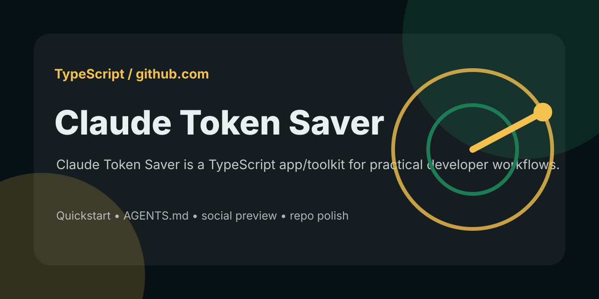

# agent-token-saver



**Use your coding agent more. Spend far fewer tokens getting there.**

[](LICENSE)
[](https://github.com/Supersynergy/agent-token-saver/actions/workflows/ci.yml)


> **Measured, not magic:** the accepted local fixture drops from **375,673**
> to **1,887** estimated visible-input units — **99.50% less payload** and
> **199.1x** the comparable payload capacity. A separate real Codex A/B saved
> **19.67% provider-reported total tokens**. These are different measurement
> layers, not a universal billing promise.

`agent-token-saver` is a small context-control layer for coding agents. It keeps
the evidence needed for a good decision and removes predictable waste before it
reaches the model: giant skill catalogs, raw logs, full process tables,
unbounded file reads and duplicated parent context.

It does **not** replace your agent, weaken its approval rules or hide quality
failures. It helps the same agent start with a smaller, more relevant packet.

## The 30-second version

Without routing, one task can accidentally load:

- hundreds of skill descriptions when only one is relevant;
- a full source file when one symbol is enough;
- a 20,000-line log when the error count and final failures answer the question;
- the same tool catalog and instructions again for every worker.

With `agent-token-saver`, the normal path is:

```text
exact local evidence
  → deterministic compact projection
  → zero or one routed skill
  → bounded structural read
  → broader tools only when the task earns them
```

The model still gets the decisive lines. It simply carries less baggage.

## Why people use it

| USP | What it means in practice |
|---|---|
| **Automatic, but reversible** | Lean prompt and Stop hooks reduce routine waste; hooks are fail-open and preserve host control. |
| **Measured honestly** | Fixture estimates, provider counters and team projections are labeled separately. Failed task oracles invalidate a saving. |
| **Works across agents** | One portable core supports Codex CLI, Claude Code, Hermes, GG Coder and generic CLI/JSON hosts. |
| **Low fixed overhead** | CLI-first routing avoids loading a broad MCP schema just to discover one useful tool. |
| **Team-aware** | Workers receive small task capsules instead of the full parent transcript; one controller keeps the final decision. |
| **Safe to adopt** | Dry-run, file hashes, merged hook JSON and backups. Optional third-party tools are detected, never silently installed. |

## Quick start

The review-first path is best for a first installation:

```bash
git clone https://github.com/Supersynergy/agent-token-saver.git
cd agent-token-saver
./install-universal.sh --profile lean --agent auto --dry-run
./install-universal.sh --profile lean --agent auto
agent-token-saver doctor --profile lean --json
```

`--agent auto` configures the supported hosts it finds. Use `--agent all` only
when you intentionally want every host integration.

Short installer:

```bash
curl -fsSL https://raw.githubusercontent.com/Supersynergy/agent-token-saver/main/install-universal.sh \
  | bash -s -- --profile lean --agent auto
```

The installer copies and hashes its own files, merges existing Codex and Claude
hook JSON, and creates backups. It does not overwrite an entire host config or
silently install optional packages.

## What happens after installation

1. **Route:** the prompt gate selects compact policy only when the task matches.
2. **Project:** noisy deterministic output becomes a small evidence view.
3. **Load:** the agent gets zero or one relevant skill, then only the code or
   logs needed for the decision.
4. **Guard:** the Stop hook checks measured session budgets and requests a
   checkpoint when needed. It never auto-continues or blocks the session.

The compact “Caveman” policy is intentionally terse. Ponytail and other
large-context helpers remain explicit, on-demand options instead of permanent
prompt tax.

## Benchmarks

### 1. Fixed payload fixture

This benchmark measures visible local payload with a transparent UTF-8
`bytes / 4` proxy. It is useful for comparing context paths; it is not a
provider invoice.

| Stack | Estimated visible input | Reduction vs. raw | Comparable payload capacity |
|---|---:|---:|---:|
| CLI selective | 1,887 | 99.50% | 199.1x |
| Lean automatic | 3,782 | 98.99% | 99.3x |
| Context mode on demand | 9,420 | 97.49% | 39.9x |
| Everything + Ponytail | 12,614 | 96.64% | 29.8x |
| No saver / raw | 375,673 | 0% | 1.0x |

Where the fixture savings come from:

| Component | Raw | Optimized | Reduction |
|---|---:|---:|---:|
| Skill routing | 36,107 | 68 | 99.81% |
| Noisy process output | 32,210 | 887 | 97.25% |
| Bounded structural source read | 6,882 | 747 | 89.15% |
| 20,000-line log projection | 300,474 | 185 | 99.94% |

Full artifact and method:
[token-stack-matrix-2026-07-15.md](data/benchmarks/token-stack-matrix-2026-07-15.md).

### 2. Real Codex provider A/B

Fresh home directory per run; same model, task and fixture. Baseline disabled
the hooks; Lean installed the canonical prompt and Stop hooks. The numbers
below are provider-reported total tokens, not the local bytes proxy.

| Task | Baseline total | Lean total | Change |
|---|---:|---:|---:|
| Process table | 29,359 | 38,800 | **32.16% more** |
| Large Git diff | 44,629 | 25,886 | **42.00% less** |
| Git history | 38,500 | 25,678 | **33.30% less** |
| **Aggregate** | **112,488** | **90,364** | **19.67% less** |

All three task oracles passed. The process-table task got worse, which is why
the README does not claim universal savings. This is one run per arm, not a
confidence interval; repeat ABBA runs before changing organization-wide
defaults.

Full artifact:
[Codex provider A/B](data/benchmarks/codex-provider-ab-2026-07-15/compact-policy/result.md).

### 3. Bounded worker packets

The three-worker control-plane fixture compares repeated full context with one
small route hint per worker.


One controller. Compact capsules. Independent lanes. One machine-checkable
oracle.

| Three-worker packet | Estimated visible input |
|---|---:|
| Naive: registry + same task capsules + full hook | 3,800 |
| Routed: same task capsules + full hook | 932 |
| Routed: same task capsules + compact hook | 530 |
| **Avoided with compact hook** | **3,270 (86.1%)** |

Capsule deduplication removes another 43.1% from the complete routed packet.
This is a no-provider-call projection, not a cost or quality claim.
Artifacts: [swarm control](data/benchmarks/swarm-control-2026-07-27.md) and
[hook hot path](data/benchmarks/hook-and-capsule-hotpath-2026-07-27.md).

### 4. Why heavier retrieval stays on demand

The local retrieval benchmark on an already-indexed repository shows why one
tool should not be forced onto every task. Visible output again uses the
`bytes / 4` proxy; Gmax index/update cost is excluded:

| Probe | Accepted | Warm median | Estimated visible output | Median peak RSS |
|---|:--:|---:|---:|---:|
| Tilth, symbol neighborhood | yes | 27 ms | 475 | 4.0 MB |
| Gmax, symbol neighborhood | yes | 372 ms | 395 | 110 MB |
| Tilth, natural-language recall | no | 13 ms | 191 | 2.8 MB |
| Gmax, natural-language recall | yes | 3,807 ms | 113 | 90 MB |

Tilth is the better Lean route for bounded symbol and file structure. Gmax
earns its cost for semantic recall or a prebuilt call graph. In this run, Gmax
also left five background processes using about 2.65 GiB combined, so it remains
an explicit session tool.

A separate code-only Graphify pilot compressed a 169,165-unit raw graph to a
477-unit bounded answer — **99.72% less visible output** — but needed an
8.3-second, 100-MiB graph build. That makes it valuable for repeated deep
analysis, not for every one-symbol question.

Artifacts:
[Tilth vs. Gmax](data/benchmarks/tilth-vs-gmax-2026-07-27.md) and
[Graphify code-only](data/benchmarks/graphify-code-only-2026-07-27.md).

## Choose a profile

Start with `lean`. Change profiles only for a concrete need.

| Profile | Best for | Visible surface |
|---|---|---|
| `minimal` | portable CLI and ledger | no visible skill or prompt hook |
| `lean` | normal daily coding | prompt gate, Stop guard, optional projection CLIs |
| `teams` | independent parallel lanes | Lean plus bounded worker-capsule contract |
| `heavy` | one explicit deep session | Lean plus graph and large-context tools |

## Supported hosts

| Host | Integration |
|---|---|
| Codex CLI | prompt gate and Stop guard |
| Claude Code | prompt gate, Stop guard, RTK when present, worker capsule |
| Hermes | installed Agent Skill |
| GG Coder | installed Markdown skill |
| Other agents | repo-local `SKILL.md` plus CLI/JSON |

See [Hooks and agents](docs/HOOKS_AND_AGENTS.md). Files on disk are not proof of
active wiring; the doctor checks the installed paths and hooks.

## AgentMaster protocol

`llmadapter ask-v2` is the strict machine interface for an external controller.
The universal installer places a managed copy on `PATH`; this optional adapter
requires [Bun](https://bun.sh/) at runtime, and `agent-token-saver doctor --json`
reports its exact capability/launcher status without starting a provider.
Use `doctor --require-llmadapter` for fail-closed AgentMaster automation.
It reads prompts from stdin or a regular file, never a positional argument.
Input is limited to 1,800 UTF-8 bytes so the worker capsule never silently
truncates it. Prompt files must be regular, owned by the current user and have
no group/other permissions. Three selected workers, a 500-token requested
ceiling and a 120-second global deadline are the defaults.

```bash
printf '%s' "$TASK" | llmadapter ask-v2 \
  --stdin --swarm --lanes local --no-cache \
  --usage-out run-accounting.json
```

`--cap` is the total selected-worker limit: at most three normally, or at most
64 with explicit `--fanout`. OpenRouter is always remote; CLI agents are remote
unless a private host lane explicitly declares `local_safe`; Ollama is local
only on a loopback URL. Remote lanes require `--allow-remote`; paid lanes also
require `--allow-paid`. HTTP redirects are rejected. Host lanes load only from
a current-user-owned, regular, non-symlink `0600`
`~/.agent-token-saver/local-lanes.json`.
The command emits exactly one
[`llmadapter.result` v2](schemas/llmadapter-result-v2.schema.json) JSON object.
The private `0600` usage file contains its completed accounting object. Token
counts remain `reported`, `estimated` or `unknown`; cost is `null` unless a
future provider supplies authoritative billing. The requested output cap is
server-side for OpenRouter, native for Ollama and advisory-only for CLI agents,
whose captured output is still byte-bounded. Every lane record exposes
`call_started`, so a controller can independently derive call counts, cache
hits, and token-coverage totals instead of trusting the summary. Shield, key,
configuration and spawn failures before transport starts remain false.

Stdin/file transport prevents prompt leakage through process arguments. It does
not stop a model from repeating input in its answer. With cache enabled, that
answer is stored in the private cache and may therefore contain repeated input;
use `--no-cache` for sensitive tasks.

The repository defines 21 built-in lanes. A host may add local lanes through
its private configuration; `llmadapter lanes` is the runtime inventory. A host
lane marked `"opt_in": true` is skipped by `all` and by the class selectors and
is reachable only by name, so a heavy lane never joins a swarm by accident.

### Opt-in extensions

Every flag below is off by default. The capability contract and the default
result envelope are unchanged, so a controller written against the strict v2
protocol keeps working without knowing these exist. `contract --extended`
advertises them for controllers that opt in.

```bash
printf '%s' "$TASK" | llmadapter ask-v2 \
  --stdin --swarm --lanes local --first-pass \
  --oracle 'grep -qi sqlite "$LLMADAPTER_ANSWER_PATH"' \
  --budget-tokens 2000
```

- `--first-pass` starts every selected lane at once, runs the oracle on each
  answer as it lands and prunes the peers at the first PASS. Pruned lanes keep a
  record with terminal `pruned`, which appears only in this mode. Without an
  oracle the first valid answer wins.
- `--oracle` is a shell command; exit 0 is PASS. It receives
  `LLMADAPTER_ANSWER_PATH` (a private `0600` file) and `LLMADAPTER_RUN_DIR`, and
  is killed after two seconds. The answer never reaches it through argv.
- `--budget-tokens N` is enforced locally rather than requested from a provider:
  an input estimate above the budget refuses before the call, a CLI lane's
  stdout is bounded at four bytes per budgeted token, and a reported total above
  the budget fails the record with `budget_exceeded`.
- `--evidence` gathers one primary-source artifact before the workers start,
  projects it to `--evidence-bytes` (default 600) and injects it into every
  capsule, so tool-less lanes can cite a fresh fact instead of being told not to
  claim one. Lookup order is `ats-url-cache`, then the provider, then the cache
  write. No scraper is bundled: the provider is a host executable named by
  `LLMADAPTER_EVIDENCE_CMD`, called as `"$LLMADAPTER_EVIDENCE_CMD" <mode>` with
  the query on stdin and the artifact on stdout. Modes are `research` (default),
  `mega` and `fetch` (needs `--evidence-target <url>`). If the artifact reports
  a bot wall (`page_status: challenge`), it is discarded and the capsule asks
  the worker for BLOCKED — the adapter never attempts a bypass. Without a
  provider the run continues with evidence marked unavailable.
- `--skill-route` asks `si` for one skill and puts its path in the capsule
  instead of relying on the four built-in regex routes. Fail-open.
- `llmadapter council` runs the identical worker stage and adds one
  fresh-context lane that reports CONSENSUS, DISSENT and CONFIDENCE. Choose it
  with `--synth-lane NAME`.
- `llmadapter cache-export --out PATH.jsonl [--with-answers] [--duckdb PATH]`
  snapshots the private cache for replay or analysis. Answers are hashed unless
  `--with-answers` is passed; the live cache keeps its `0600` files.

## Measure your own result

The included ledger combines parent runs, workers, retries and fallbacks.
Provider counters are authoritative; visible local files remain clearly marked
estimates.

```bash
agent-token-ledger \
  --usage parent=run.jsonl \
  --usage child-review=child.jsonl \
  --provider codex \
  --require-complete-team \
  --require-within-guard \
  --format markdown \
  --out token-ledger.md
```

For a credible before/after result, keep the model, task, fixture and acceptance
oracle fixed. Record provider input/output, cache classes, latency, retries and
failures. Never translate a local payload estimate directly into money saved.

## Verify the checkout

```bash
uv sync --extra dev
uv run pytest -q
uv run ruff check scripts integration tests
bash scripts/neutral_install_smoke.sh
agent-token-saver doctor --profile teams --json
```

`core-ready` means the portable core works while an optional tool is missing.
`full` means every tool required by the selected profile is detected. Neither
status claims that provider credentials, private infrastructure or browser
sessions work.

## Safety and honest limits

- Hooks are fail-open and preserve host approval, sandbox and Stop ownership.
- No expensive maintenance scan belongs in a hot hook.
- Release gate: scan public artifacts for private paths, credentials, process
  IDs and raw controller/transcript output before publishing.
- The installer merges recognized config sections and creates backups.
- Optional tools remain optional; no always-on broad tool catalog.
- Savings depend on workload. Quality gates come before token counts.
- One controller owns scope and the final answer. Default team cap: three
  independent workers with 300–700-token task capsules.

## Documentation

- [Tooling and wiring](docs/TOOLING_AND_WIRING.md)
- [Hooks and agents](docs/HOOKS_AND_AGENTS.md)
- [Full measurement method](docs/FULL_CONTEXT_MEASUREMENT.md)
- [Subagent context protocol](docs/SUBAGENT_CONTEXT_PROTOCOL.md)
- [Worker control plane](docs/SWARM_CONTROL_PLANE.md)
- [All benchmark artifacts](data/benchmarks/)
- [Changelog](CHANGELOG.md)
- [Security policy](SECURITY.md)

License: MIT.
